# PBL1-PDS

Repositório com códigos compatíveis com Octave da disciplina de MI - Processamento Digital de Sinais.

Este projeto visa resolver o desafio proposto à equipe de engenharia da **SigmaDSP Inc.**, consistindo na avaliação do teorema da amostragem de sinais analógicos de tempo contínuo, a primeira etapa da conversão Analógico/Digital. 

O código realiza uma análise analítica nos domínios do tempo e da frequência, comparando os três métodos clássicos de amostragem. As simulações demonstram como esses métodos afetam o sinal, seu espectro e os critérios estritos para a reconstrução do sinal original sem perda de informação.

## Tópicos Importantes Abordados

A partir da fundamentação teórica estudada, os códigos implementam os seguintes conceitos:

*   **Filtragem de Sinal:** Simulação da limitação em banda de um sinal para atenuar frequências indesejáveis e evitar a sobreposição.
*   **Teorema da Amostragem de Nyquist-Shannon:** A regra de que a frequência de amostragem deve ser maior que o dobro da frequência máxima do sinal para que ele possa ser unicamente determinado pelas suas amostras.
*   **Critério de Nyquist e Aliasing:** A demonstração visual (via variação da frequência de amostragem) do fenômeno de *aliasing*, que ocorre quando o critério de Nyquist não é atendido, resultando na sobreposição das réplicas espectrais e perda irrecuperável de informação original.
*   **Reconstrução do Sinal:** A recuperação do sinal original analógico aplicando filtros passa-baixas (para isolar a banda base) e os devidos ganhos/equalizações específicas para cada método.

## Métodos de Amostragem Analisados

1.  **Amostragem Ideal:** Método estritamente matemático onde o sinal é convertido em uma sequência de valores instantâneos, mapeado por impulsos ideais de duração nula. No domínio da frequência, gera réplicas perfeitas do espectro do sinal original.
2.  **Amostragem Natural:** O sinal contínuo é multiplicado por um trem de pulsos retangulares de largura finita. Durante a largura do pulso, a amostra acompanha a exata variação e formato do sinal original. Seu espectro apresenta réplicas do sinal original que sofrem ponderação.
3.  **Amostragem Instantânea de Topo Plano (Flat-Top):** O valor da amostra capturada é mantido constante durante todo o intervalo do pulso retangular, formando um "topo plano". Este método é mais factível fisicamente, mas introduz no espectro o chamado **efeito de abertura**, causando atenuação nas componentes de altas frequências que precisam ser corrigidas com um filtro equalizador na reconstrução.

## Estrutura do Projeto

O código modular utiliza funções de amostragem implementadas em arquivos separados para organizar a geração dos sinais:

*   `src/sampling` - Implementações dos métodos de amostragem.
*   `src/transform` - Implementação das transformadas de uma senoide a partir do cálculo analítico dos métodos de amostragem.
*   `src/reconstruction` - Implementação de algoritmo de reconstrução da Transformada Discreta de Fourier Inversa (IDFT) para visualização do sinal reconstruído no domínio do tempo e seu espectro no domínio da frequência.

## Funcionalidades e Resultados

*   **Geração de Sinais:** Criação de sinais senoidais com limitação de banda.
*   **Análise no Tempo:** Gráficos que comparam o sinal original com as amostras resultantes de cada método.
*   **Análise na Frequência:** Espectros analíticos que demonstram as réplicas espectrais, ponderações e o efeito de abertura.
*   **Ajuste Dinâmico:** Capacidade de ajustar a frequência de amostragem para observar claramente situações com e sem a ocorrência de *aliasing*.

## Simulações e Resultados

Abaixo estão listados os resultados das simulações visuais, organizados por tipo de método e mudança de parâmetro.

### 1. Filtro Passa-Baixas Ideal

| Reconstrução Contínua (f1) |
| :---: |
| 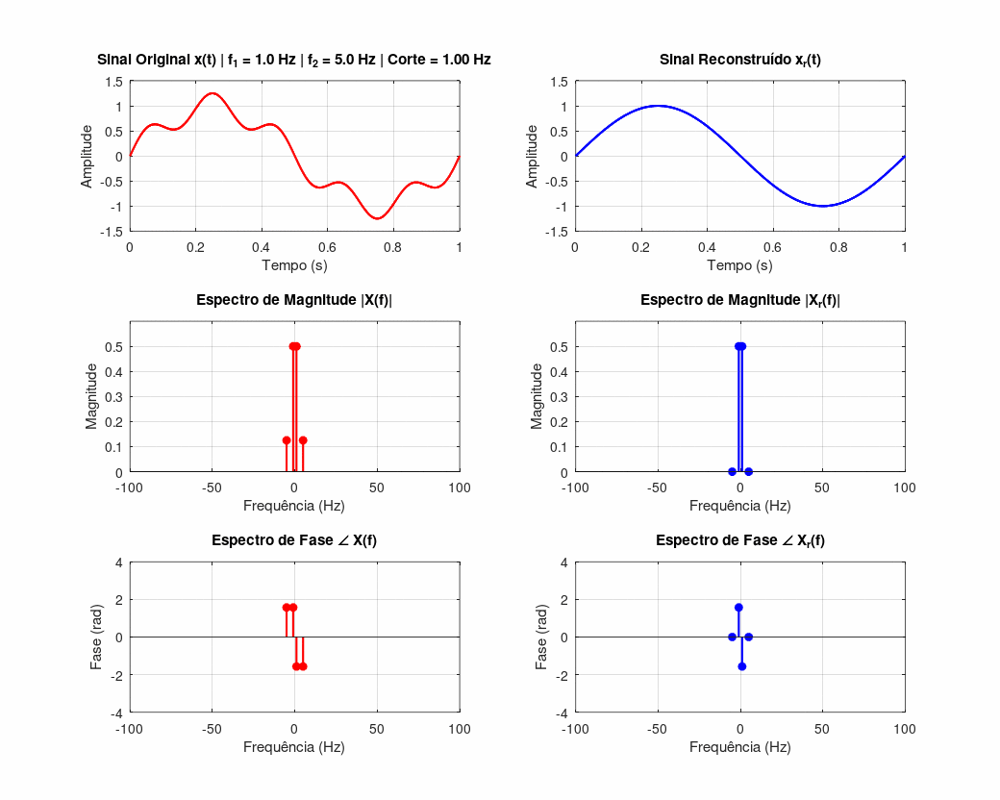 |
| Sinal contínuo filtrado diretamente no domínio da frequência (sem amostragem), variando a frequência do sinal de interesse, bem como a frequência de corte que o acompanha. |

| Reconstrução Contínua (f2) |
| :---: |
| 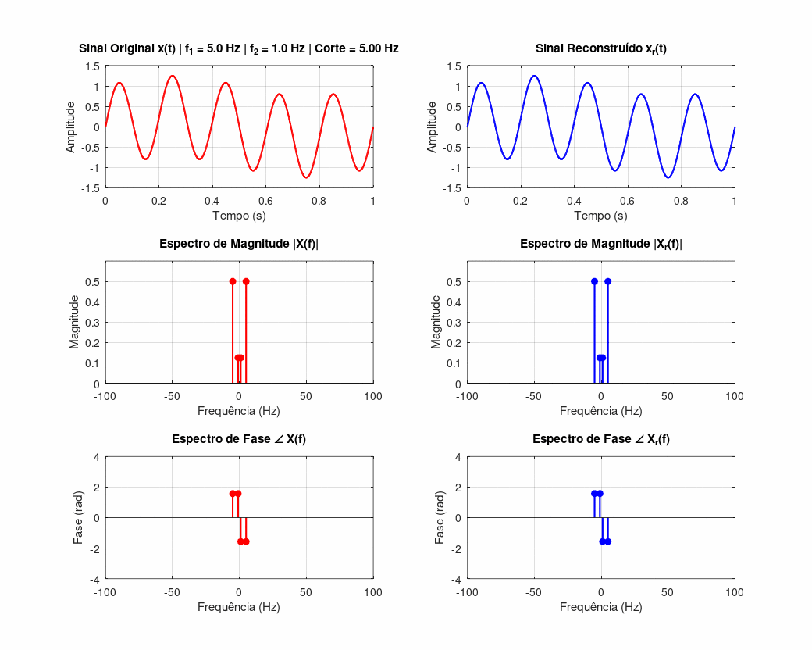 |
| Mesmo filtro passa-baixas ideal, agora variando a frequência da senoide de ruído. Mostra como a banda passante determina quais componentes são preservadas. |

### 2. Amostragem Ideal

| Amostragem |
| :---: |
| **Alteração da Frequência do Sinal** 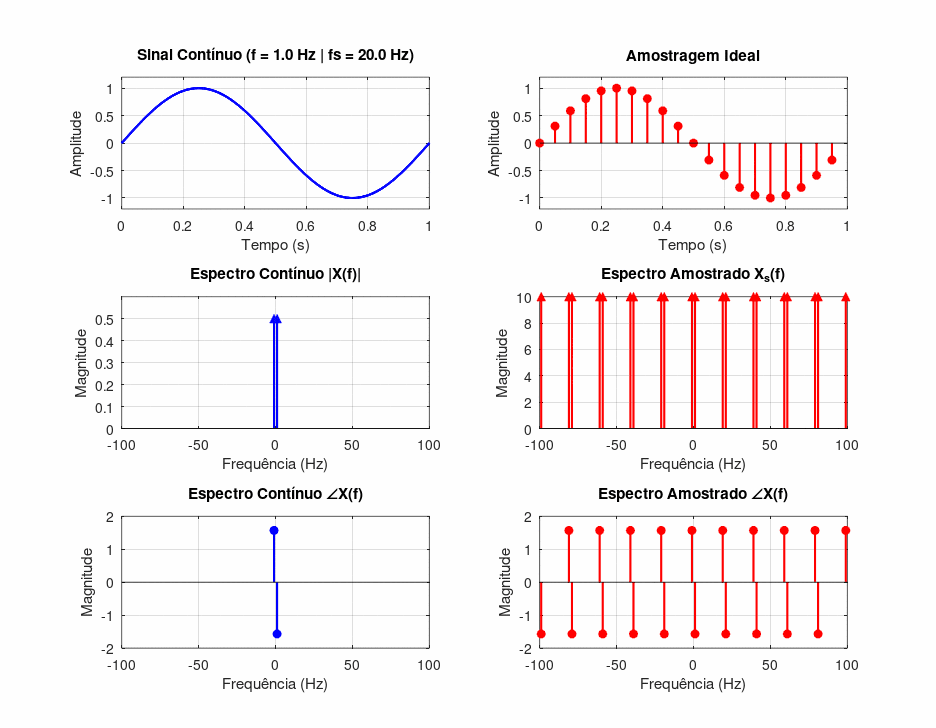 |
| A frequência do sinal aumenta com $f_s$ fixa. Observe o sinal se aproximando e ultrapassando o limite de Nyquist ($f_s/2$), causando aliasing. |

| Reconstrução |
| :---: |
| **Alteração da Frequência do Sinal** 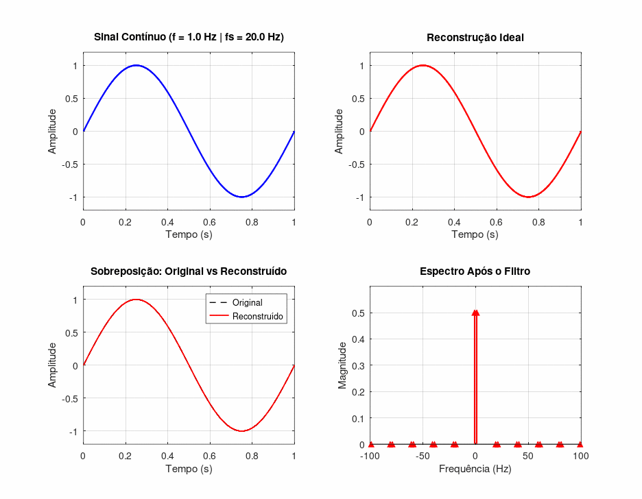 |
| O sinal é reconstruído a partir das amostras ideais via filtro passa-baixas. Note como a reconstrução deixa de acompanhar o sinal original após o limiar de Nyquist. |

| Amostragem |
| :---: |
| **Alteração da Frequência de Amostragem (Fs)** 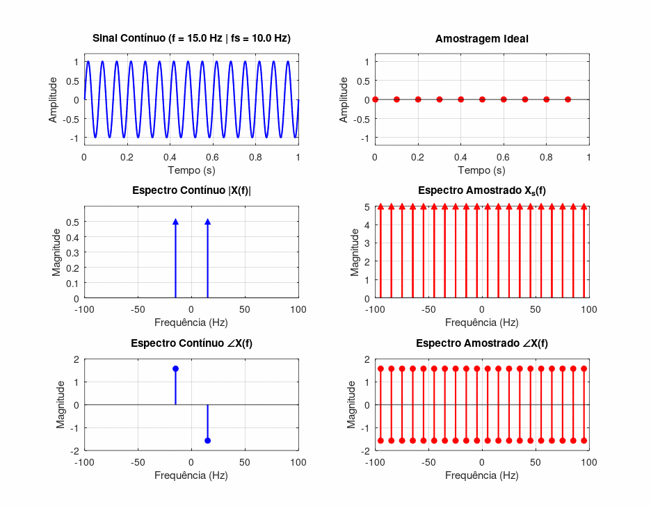 |
| A frequência de amostragem $f_s$ varia com o sinal fixo. Observe o espectro amostrado: as réplicas se afastam conforme $f_s$ aumenta. |

| Reconstrução |
| :---: |
| **Alteração da Frequência de Amostragem (Fs)** 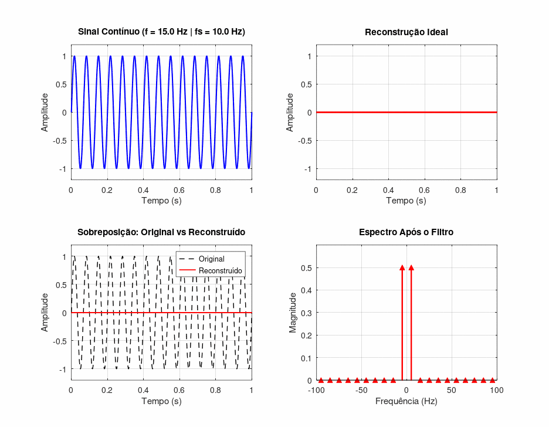 |
| Reconstrução do mesmo sinal variando $f_s$. Mostra a transição e aliasing (Nyquist violado) e a reconstrução correta (Nyquist respeitado). |

### 3. Amostragem Natural

| Amostragem |
| :---: |
| **Alteração da Frequência do Sinal** 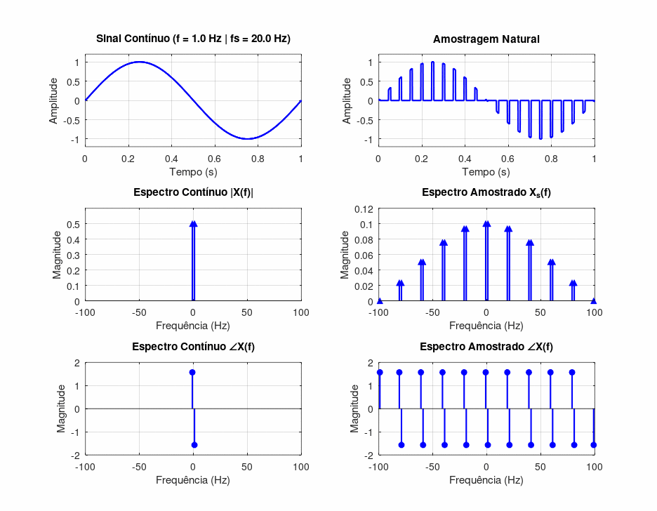 |
| Amostragem natural (trem de pulsos retangulares) com frequência do sinal variando. |

| Reconstrução |
| :---: |
| **Alteração da Frequência do Sinal** 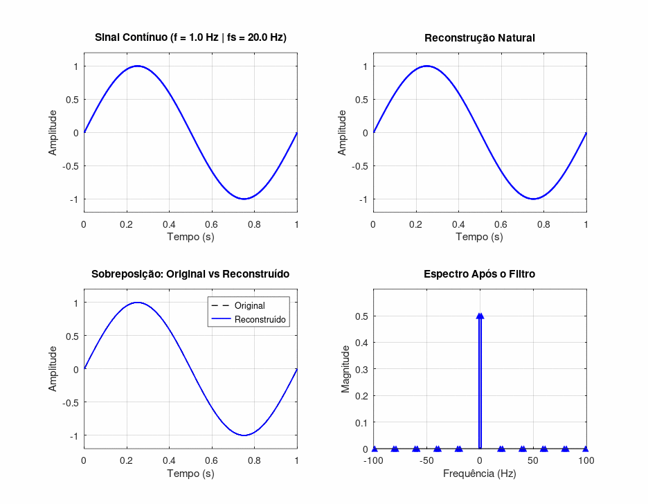 |
| Reconstrução a partir da amostragem natural. Mesma dinâmica de aliasing da amostragem ideal ao cruzar Nyquist, mas com o espectro adicionalmente moldado pelo sinc da largura de pulso $\tau$. |

| Amostragem |
| :---: |
| **Alteração da Frequência de Amostragem (Fs)** 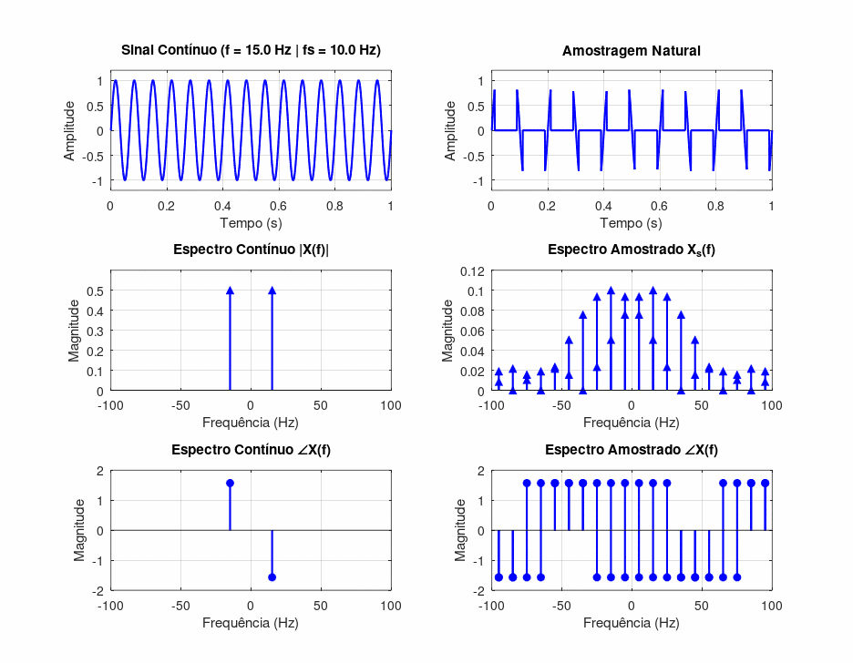 |
| Amostragem natural com $f_s$ variando. Observe como as distâncias entre os pares de réplicas mudam junto com $f_s$. |

| Reconstrução |
| :---: |
| **Alteração da Frequência de Amostragem (Fs)** 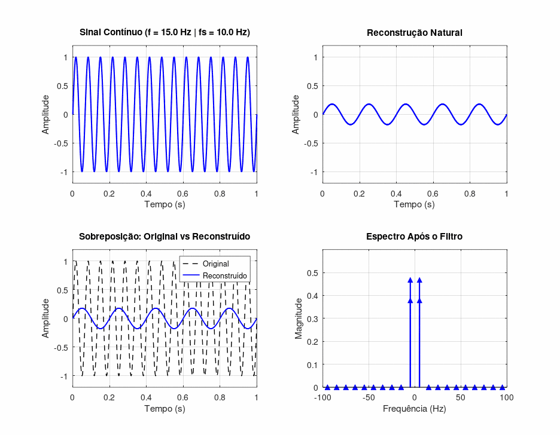 |
| Reconstrução variando $f_s$. Mostra a mesma transição Nyquist-OK/aliasing vista na amostragem ideal, agora sob amostragem natural. |

### 4. Mudança Flat-Top

| Amostragem |
| :---: |
| **Alteração da Frequência do Sinal** 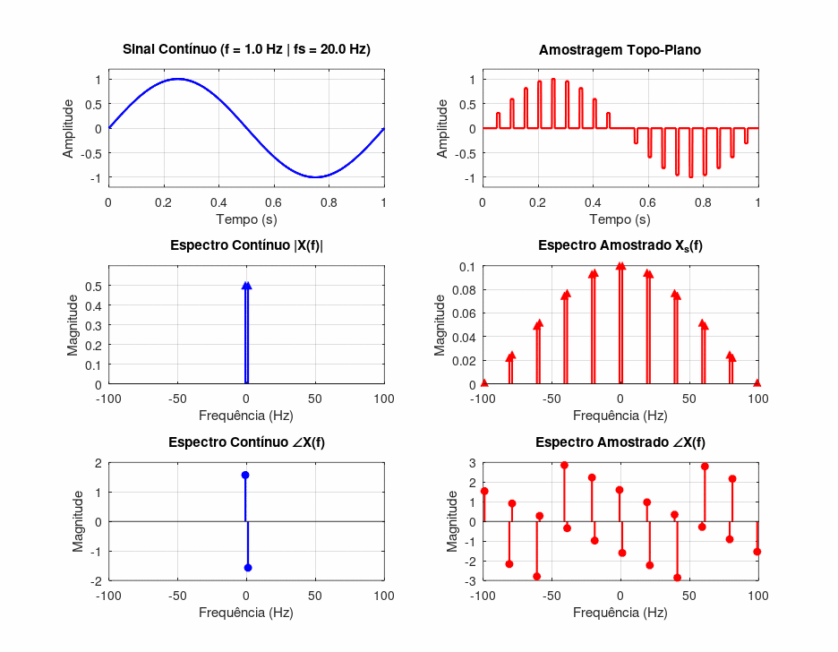 |
| Amostragem topo-plano (sample-and-hold) com frequência do sinal variando. Cada amostra é mantida constante ("segurada") durante o intervalo do pulso, ao contrário da natural. Nota-se também o deslocamento de fase decorrente da causalidade do pulso. |

| Reconstrução |
| :---: |
| **Alteração da Frequência do Sinal** 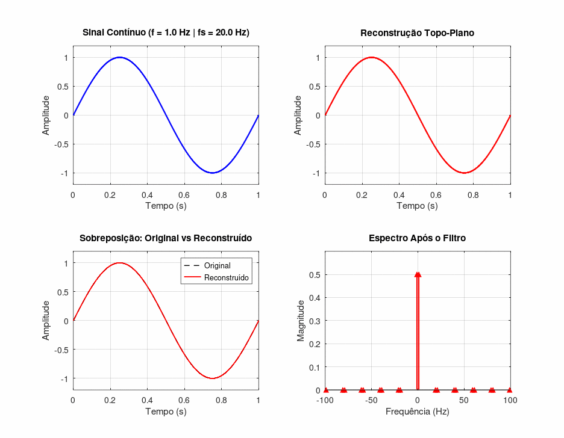 |
| Reconstrução a partir da amostragem topo-plano. |

| Amostragem |
| :---: |
| **Alteração da Frequência de Amostragem (Fs)** 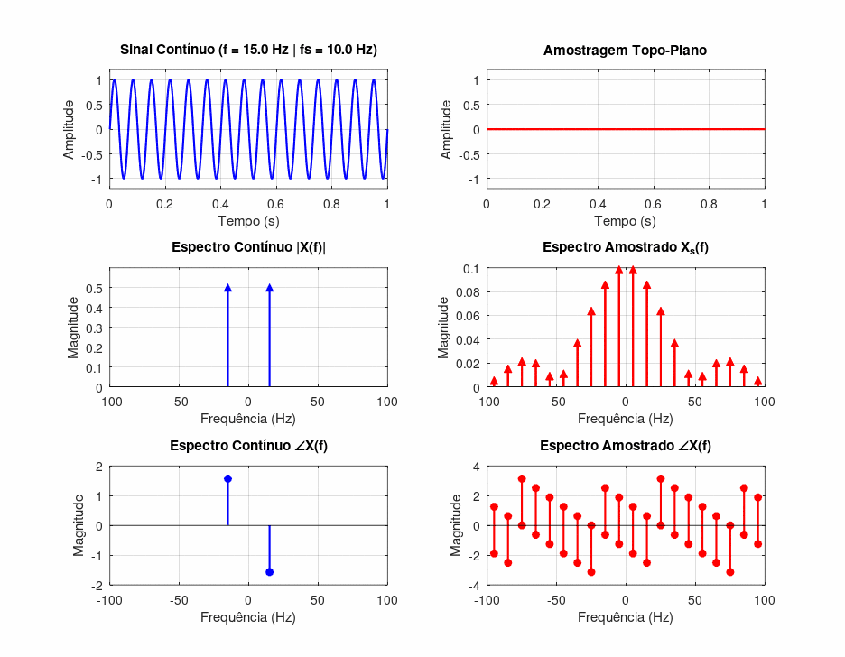 |
| Amostragem topo-plano com $f_s$ variando. Observe o efeito conjunto da mudança de $f_s$ sobre a largura do pulso e o espectro amostrado. |

| Reconstrução |
| :---: |
| **Alteração da Frequência de Amostragem (Fs)**  |
| Reconstrução variando $f_s$. |